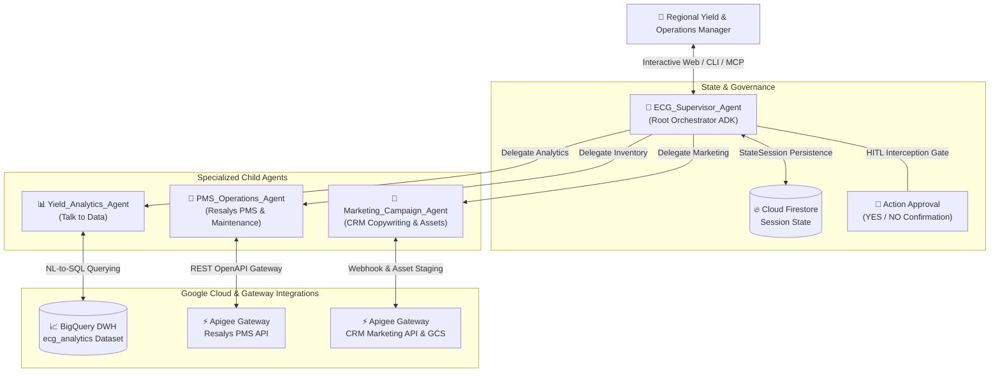

# European Camping Group (ECG) — Multi-Agent System

[](https://cloud.google.com/products/agent-builder)
[](https://cloud.google.com/vertex-ai)
[](https://cloud.google.com/bigquery)
[](./pms-crm-mcp-server/README.md)
[](https://www.python.org/)
[](./spec.md)

An enterprise-grade **Autonomous Multi-Agent System** built for **European Camping Group (ECG)** using the **Google Agent Development Kit (ADK)** and deployed on **Vertex AI Agent Engine**. 

This system orchestrates conversational workflows across data analytics, property management systems (PMS), and marketing CRM gateways. It bridges data silos between **BigQuery Yield Analytics**, **Resalys PMS Inventory Control**, and **Apigee CRM Campaign Staging**, reducing operational reaction time from days to minutes while enforcing strict **Human-in-the-Loop (HITL)** governance and zero-copy data security.

---

## 🏛️ System Architecture (BMAD Framework)

The project is structured following the **BMAD** (*BRIEF → MAP → ACT → DOUBLE-CHECK*) methodology defined in the canonical specification ([`spec.md`](./spec.md)). 

It implements the **Supervisor Multi-Agent Pattern**: a central root orchestrator evaluates user intent, maintains cross-turn conversational context in Google Cloud Firestore, and delegates specialized sub-tasks to domain agents.



### 🤖 Core Agent Roster

| Agent Name | Model Tier | Module Path | Responsibility |
| :--- | :--- | :--- | :--- |
| **`ECG_Supervisor_Agent`** | `gemini-2.5-pro` | [`src/agents/supervisor.py`](./src/agents/supervisor.py) | Parses user intent, manages session variables across turns via `StateSession`, routes execution to sub-agents, and enforces HITL confirmation gates before any mutating action. |
| **`Yield_Analytics_Agent`** | `gemini-2.5-pro` | [`src/agents/yield_analytics.py`](./src/agents/yield_analytics.py) | Connects to BigQuery (`ecg_analytics`), translating natural language into parameterized SQL to compute Occupancy Rate, AVPN, RevPAR, and booking pacing across campsite clusters. |
| **`PMS_Operations_Agent`** | `gemini-3.6-flash` | [`src/agents/pms_operations.py`](./src/agents/pms_operations.py) | Interacts with Resalys PMS and maintenance APIs via Apigee. Inspects unit statuses (`HELD_BACK`, `MAINTENANCE`, `BOOKED`) and releases inventory for sale. |
| **`Marketing_Campaign_Agent`** | `gemini-2.5-pro` | [`src/agents/marketing_campaign.py`](./src/agents/marketing_campaign.py) | Generates localized promotional copywriting (NL, FR, DE, UK), resolves Imagen banner assets from GCS (`gs://ecg-marketing-assets/genai/`), and stages CRM flash campaign drafts. |

---

## 🌟 Key Features & Capabilities

### 1. 🧠 Stateful Session Retention (`StateSession`)
Unlike stateless chat prompts, the supervisor retains multi-turn context (selected campsite IDs, cluster names, date windows, unit IDs, and target markets) using `StateSession` backed by **Google Cloud Firestore** ([`src/datastore/firestore_client.py`](./src/datastore/firestore_client.py)). Users can seamlessly transition from querying analytics to releasing stock without repeating parameters.

### 2. 🛑 Human-in-the-Loop (HITL) Governance Gate
Security and operational integrity are paramount. Any mutating tool execution (e.g., `PUT /pms/v1/units/status` or `POST /marketing/v1/campaigns/draft`) automatically pauses ADK agent execution and issues an interactive approval card. Action callbacks execute **only** upon explicit human approval.

### 3. 🎨 Interactive MCP UI Widget Server
Includes a standalone, host-theme-aware **Model Context Protocol (MCP) App Server** ([`pms-crm-mcp-server/`](./pms-crm-mcp-server/README.md)) built with Vite and `@modelcontextprotocol/ext-apps`. When embedded inside MCP clients (Claude Desktop, Gemini Enterprise, or web widgets), it renders:
* Real-time **Chart.js doughnut charts** breaking down mobil-home inventory statuses.
* Interactive controls for batch-releasing held-back units.
* Live ad copywriting previews auto-translated into Dutch, French, German, or English with GCS banner resolution.

### 4. ⚡ Live BigQuery Seeding & NL-to-SQL
Includes automated schema creation and data loaders ([`scripts/seed_bigquery.py`](./scripts/seed_bigquery.py)) that populate live BigQuery datasets with realistic 2025/2026 occupancy, revenue, and held-back unit records for campsite clusters (e.g., `LA_SIRENE_06`, `HIPOCAMP_07`).

### 5. 🚀 Automated Cloud Engine Deployment Pipeline
Provides an end-to-end CI/CD pipeline ([`scripts/pipeline.py`](./scripts/pipeline.py)) to deploy, verify, and register the multi-agent system directly onto **Vertex AI Agent Engine** and **Gemini Enterprise**.

---

## 📂 Repository Structure

```text
agent-ecg/
├── src/
│   ├── agents/                   # Core Google ADK Agent definitions
│   │   ├── supervisor.py         # Root Supervisor & StateSession manager
│   │   ├── yield_analytics.py    # BigQuery NL-to-SQL analytics agent
│   │   ├── pms_operations.py     # Resalys PMS inventory release agent
│   │   └── marketing_campaign.py # CRM copywriting and campaign staging agent
│   ├── datastore/                # Google Cloud Firestore persistence layer
│   │   └── firestore_client.py   # Stateful session storage client
│   └── config.py                 # Centralized environment & model configuration
├── pms-crm-mcp-server/           # Interactive MCP UI App Server (Vite / TypeScript)
│   ├── src/                      # Client UI widget logic & MCP tools
│   ├── server.ts                 # Stdio / HTTP MCP server implementation
│   └── README.md                 # Dedicated MCP Server documentation
├── scripts/                      # Automation, seeding, and deployment tools
│   ├── seed_bigquery.py          # Live BigQuery DWH database seeder
│   ├── seed_ecg_analytics.sql    # DML/DDL schema definitions for ECG analytics
│   ├── pipeline.py               # Unified deployment & verification pipeline
│   └── verify_bulletproof_suite.py # 8-step live Reasoning Engine verification suite
├── tests/                        # Comprehensive unit & integration test suite (32 tests)
├── docs/                         # Walkthroughs, prompt guides, and execution plans
├── spec.md                       # Canonical BMAD technical specification (French)
├── pyproject.toml                # Python project metadata & uv dependencies
└── run_agent.sh                  # Interactive startup script for ADK Web/CLI
```

---

## 🛠️ Getting Started

### Prerequisites
* **Python 3.10+** (managed via [`uv`](https://docs.astral.sh/uv/))
* **Node.js 18+** & **npm** (for the MCP UI App server)
* **Google Cloud SDK** (`gcloud`) authenticated with Application Default Credentials (ADC):
  ```bash
  gcloud auth application-default login
  ```

### 1. Install Python Dependencies
Clone the repository and install dependencies using `uv`:
```bash
git clone https://github.com/julienmiquel/agent-AI.git
cd agent-ecg
uv sync
```

### 2. Build the MCP App Server UI
Compile the single-file Vite interactive UI bundle for the MCP server:
```bash
cd pms-crm-mcp-server
npm install --registry=https://registry.npmjs.org/
npm run build
cd ..
```

---

## 🚀 Running the System

### Option A: Interactive ADK Web Server / Terminal CLI
You can launch the core Supervisor Agent locally using the helper script:

```bash
# Launch the interactive ADK Web UI Server (opens in browser)
./run_agent.sh

# Or launch in terminal CLI interactive mode
./run_agent.sh --cli
```

### Option B: Running the Interactive MCP UI App Server
To host the interactive widget for Claude Desktop, Gemini Enterprise, or custom web hosts:

```bash
cd pms-crm-mcp-server

# Start HTTP Server (serves widget on http://localhost:3002/widget)
npm run serve:http

# Or run stdio server for local LLM desktop integrations
npm run serve:stdio
```

---

## 🧪 Testing & Verification

The project includes an exhaustive test suite covering unit logic, mock API gateways, NL-to-SQL generation, and live BigQuery execution.

### Run Unit & Integration Tests
Execute the full pytest suite (32 tests) across all agents and MCP tools:
```bash
uv run pytest
```

### Seed Live BigQuery Analytics Data
To initialize or reset the live BigQuery dataset (`customer-demo-01.ecg_analytics`) with synthetic 2025/2026 campsite data:
```bash
uv run python3 ./scripts/seed_bigquery.py
```
*See the execution summary in [`docs/walkthrough.md`](./docs/walkthrough.md).*

### Verify Vertex AI Agent Engine Deployment
Run the bulletproof 8-step verification pipeline against the live deployed cloud Reasoning Engine:
```bash
uv run python3 ./scripts/verify_bulletproof_suite.py
```

---

## 📚 Documentation & Further Reading

* 📐 **[Technical Specification (`spec.md`)](./spec.md)**: Full BMAD technical specifications, personas, and architecture goals.
* 🚶 **[Execution Walkthrough (`docs/walkthrough.md`)](./docs/walkthrough.md)**: Logs and results of live BigQuery seeding and test suite execution.
* 💬 **[BigQuery Prompt Guide (`docs/bigquery_agent_prompts.md`)](./docs/bigquery_agent_prompts.md)**: Reference natural language prompts and expected SQL translations for Yield Analytics.
* 🖥️ **[MCP Server Guide (`pms-crm-mcp-server/README.md`)](./pms-crm-mcp-server/README.md)**: Detailed documentation on registered MCP tools, theme adaptation, and Vite bundling.

---
*Built with ❤️ by the ECG DSI & Digital Team in collaboration with Google Cloud Advanced Agentic Coding.*
