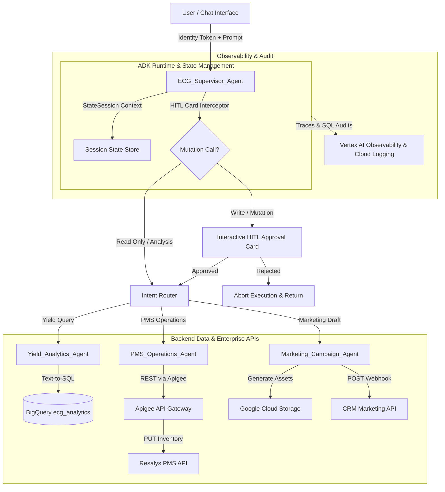

# Architecture Spine — ECG Multi-Agent Yield & Operations System

## Design Paradigm

The architecture adopts the **Supervisor Multi-Agent Pattern** using the **Google Agent Development Kit (ADK)**. 

A single root orchestrator (`ECG_Supervisor_Agent`) handles client interactions, maintains multi-turn session state (`StateSession`), and routes domain tasks to specialized child agents (`Yield_Analytics_Agent`, `PMS_Operations_Agent`, `Marketing_Campaign_Agent`). All mutating actions (`PUT`, `POST`, `DELETE`) are intercepted by a Human-in-the-Loop (HITL) confirmation gate before tool execution.



---

## Invariants & Rules

### AD-1 — Supervisor Multi-Agent Topology
- **Binds:** `FR-1`, `FR-2`, `all`
- **Prevents:** Direct client access to sub-agents or fragmented state across domain tools.
- **Rule:** All incoming user turns MUST land at `ECG_Supervisor_Agent`. Sub-agents MUST NOT be invoked directly by external clients.

### AD-2 — Human-in-the-Loop (HITL) Interception Gate
- **Binds:** `FR-3`, `FR-6`, `FR-8`
- **Prevents:** Unauthorized, automated, or unexpected side-effect mutations on Resalys PMS or CRM systems.
- **Rule:** Any tool callback initiating HTTP `PUT`, `POST`, `PATCH`, or `DELETE` MUST pause execution and return an interactive HITL confirmation card. Callback execution occurs ONLY upon receiving explicit `YES` approval.

### AD-3 — Identity Passthrough Authorization
- **Binds:** `FR-7`, `Security`
- **Prevents:** Service-account privilege escalation or unauthenticated API access.
- **Rule:** User OAuth2 Cloud Identity Bearer tokens MUST be forwarded verbatim in the `Authorization` header across Apigee API Gateway calls and BigQuery IAM queries.

### AD-4 — Zero Data Duplication DWH Analytics
- **Binds:** `FR-4`, `FR-5`
- **Prevents:** Stale analytical data, shadow caching, or unauthorized local data dumps.
- **Rule:** `Yield_Analytics_Agent` MUST execute SQL queries live against BigQuery dataset `ecg_analytics`. Storing analytical results in local database tables or caching layers is strictly prohibited.

### AD-5 — Apigee REST OpenAPI Tool Binding
- **Binds:** `FR-6`
- **Prevents:** Direct database access or non-standard API calls to Resalys PMS.
- **Rule:** `PMS_Operations_Agent` MUST interact with Resalys PMS exclusively through OpenAPI specifications deployed on Apigee API Gateway (`https://api.ecg.camp/pms/v1`).

### AD-6 — Multimodal Marketing Draft Staging
- **Binds:** `FR-8`
- **Prevents:** Direct customer messaging or unvalidated asset publishing.
- **Rule:** `Marketing_Campaign_Agent` MUST store generated visual assets in GCS (`gs://ecg-marketing-assets/genai/`) and stage campaign payloads as *drafts* via `POST /marketing/v1/campaigns/draft`. Direct send webhooks are prohibited.

### AD-7 — Telemetry & Audit Trace Observability
- **Binds:** `Observability`, `Audit`
- **Prevents:** Untraced agent decisions, unaccounted SQL execution, or silent tool failures.
- **Rule:** All agent reasoning traces, intent routing events, generated SQL queries, and tool execution outputs MUST be streamed to Vertex AI Agent Observability and Cloud Logging with user ID metadata.

### AD-8 — Model Standard (`gemini-3.5-flash`)
- **Binds:** `all`
- **Prevents:** Dependency on legacy or unavailable model identifiers (such as `gemini-1.5`).
- **Rule:** All ADK agent components (`ECG_Supervisor_Agent`, `Yield_Analytics_Agent`, `PMS_Operations_Agent`, `Marketing_Campaign_Agent`) MUST use `gemini-3.5-flash` as their default LLM backbone.

---

## Consistency Conventions

| Concern | Convention |
| --- | --- |
| Naming (Agents & Tools) | PascalCase for Agents (`ECG_Supervisor_Agent`, `Yield_Analytics_Agent`); snake_case for Tools (`query_ecg_yield_data`, `resalys_update_unit_inventory`). |
| Data Formats | Dates in ISO-8601 `YYYY-MM-DD`; metric names uppercase (`OCCUPANCY_RATE`, `AVPN`, `REVPAR`). |
| API Envelopes & Auth | REST headers include `Authorization: Bearer {user_token}`; error payloads standard JSON `{ "error": { "code": 4xx/5xx, "message": "..." } }`. |
| State Management | Multi-turn state stored in `StateSession` under namespaced keys (`session.campsite_id`, `session.target_cluster`). |

---

## Stack

| Name | Version | Role / Purpose |
| --- | --- | --- |
| Python | 3.11+ | ADK Agent runtime language environment |
| Google ADK (`google-genai`) | Latest (0.1.0+) | Framework for Supervisor, Agents, Tools, and Runners |
| Gemini 3.5 Flash | `gemini-3.5-flash` | Standard LLM backbone for Supervisor, Yield Analytics, PMS Operations, and Marketing |
| Imagen 3 | `imagen-3.0` | Asset generation for Marketing campaign visuals |
| BigQuery | Managed GCP | Cloud Data Warehouse (`ecg_analytics` dataset) |
| Apigee API Gateway | Managed GCP | API management, routing, rate limiting, and OAuth passthrough |
| Cloud Storage (GCS) | Managed GCP | Object storage for GenAI marketing assets (`gs://ecg-marketing-assets/`) |
| Cloud Logging / Vertex AI Observability | Managed GCP | Distributed tracing, prompt logging, and audit trail |

---

## Structural Seed

```text
src/
  agents/
    supervisor.py       # ECG_Supervisor_Agent definition and routing logic
    yield_agent.py      # Yield_Analytics_Agent with BigQueryTool binding
    pms_agent.py        # PMS_Operations_Agent with Apigee OpenAPITool
    marketing_agent.py  # Marketing_Campaign_Agent with Imagen & CRM tools
  tools/
    bigquery_tool.py    # Custom BigQuery wrapper & NL-to-SQL tool
    resalys_tool.py      # OpenAPI spec binder for Resalys PMS status API
    crm_tool.py         # CRM campaign draft staging webhook tool
  config/
    settings.py         # Environment configuration & GCP project settings
  main.py               # ADK Runner entry point & API route setup
openapi/
  pms_openapi.json      # OpenAPI 3.0 specification for Resalys PMS API
  crm_openapi.json      # OpenAPI 3.0 specification for Marketing CRM API
```

---

## Capability → Architecture Map

| Capability / FR | Lives in | Governed by |
| --- | --- | --- |
| FR-1 (Intent Routing) | `src/agents/supervisor.py` | `AD-1`, Supervisor Pattern |
| FR-2 (Session State) | `ADK StateSession` | `AD-1`, State Convention |
| FR-3 (HITL Interception Card) | `ADK Runner / Card Middleware` | `AD-2` |
| FR-4 (Text-to-SQL BigQuery) | `src/agents/yield_agent.py` | `AD-4` |
| FR-5 (Cluster Comparison) | `src/tools/bigquery_tool.py` | `AD-4` |
| FR-6 (Resalys Inventory Update) | `src/agents/pms_agent.py` | `AD-5`, `AD-2` |
| FR-7 (Identity Passthrough) | `src/tools/resalys_tool.py` | `AD-3` |
| FR-8 (CRM Flash Campaign Staging) | `src/agents/marketing_agent.py` | `AD-6`, `AD-2` |

---

## Deferred

| Item | Reason for Deferral |
| --- | --- |
| Dynamic Pricing Auto-Tuning | Requires ML yield optimization model approval; v1 relies on human manager price decisions. |
| Physical IoT Lock Synchronization | Maintenance physical lock API integration deferred to v2. |
| Multi-Channel Voice Interface | Voice-to-Text layer deferred to v2; v1 focuses on web chat UI. |
