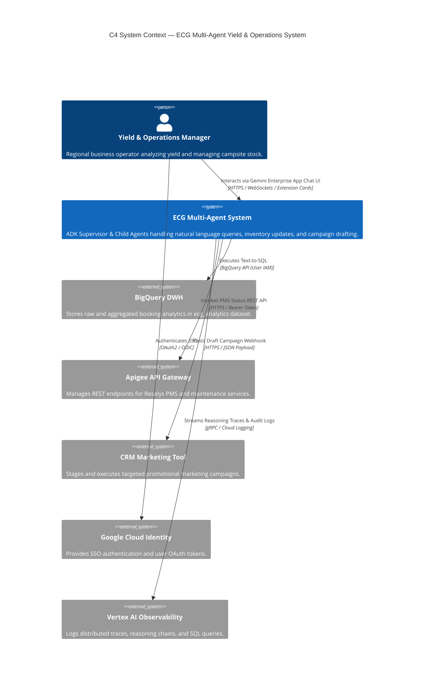
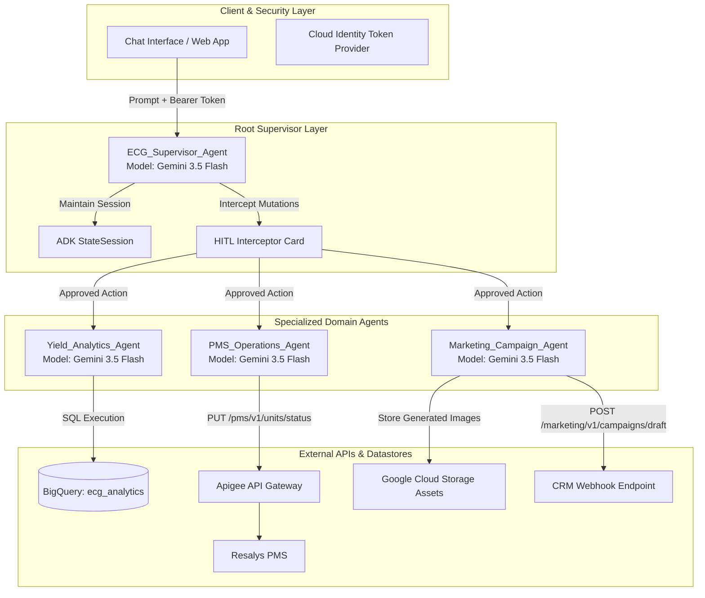
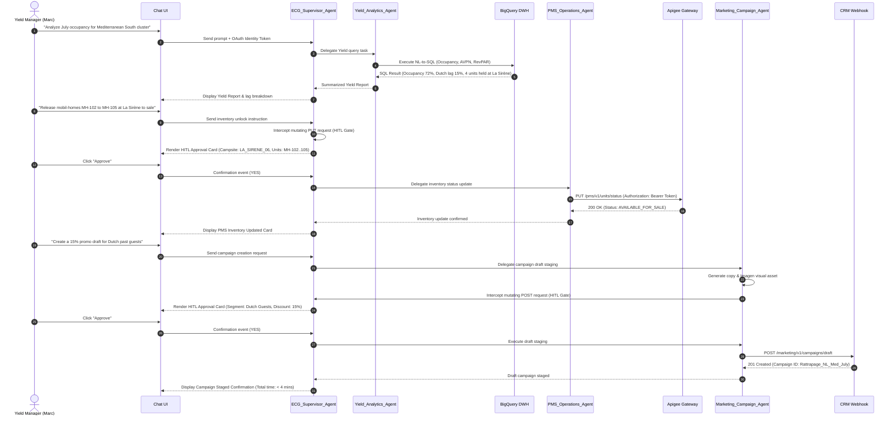

# Solution Design Document: ECG Multi-Agent Yield & Operations System

**Version:** 1.0.0  
**Date:** 2026-07-20  
**Author:** AI Systems Architecture Team  
**Target Audience:** DSI / Enterprise IT, Lead Developers, Yield Operations Team  

---

## 1. Executive Summary & Business Context

Holiday company operates over 300 outdoor holiday resorts across Europe. Managing yield (occupancy rate, average value per night, RevPAR) requires constant monitoring of booking trends, physical accommodation readiness, and rapid marketing activation.

Currently, data silos between the BigQuery Data Warehouse, the Resalys Property Management System (PMS), and CRM marketing tools lead to a 24–48 hour lag between identifying an underperforming campsite cluster and launching a recovery promotion.

The **ECG Multi-Agent Yield & Operations System** leverages Google's **Agent Development Kit (ADK)** and **Gemini Enterprise models** to unify these domains into an interactive natural language assistant. By deploying a **Supervisor Multi-Agent Pattern**, the system empowers yield managers to query real-time analytics, release mobil-home stock, and stage targeted flash marketing campaigns in under 5 minutes, backed by strict **Human-in-the-Loop (HITL)** governance and **Identity Passthrough** security.

---

## 2. System Architecture & C4 Views

### 2.1 C4 System Context View

> **Note on UI Host Container:** The conversational UI runs natively inside the **Gemini Enterprise Application** (Discovery Engine / Agent Builder). The system leverages custom Extension Cards and Structured Action Cards for HITL approvals embedded within the Gemini chat stream.

---

## 3. Multi-Agent Component Design

The system consists of one **Root Supervisor Agent** and three **Domain Child Agents**:

### 3.1 Agent Responsibilities

1. **`ECG_Supervisor_Agent`**:
   - Parses intent and extracts context (campsite ID, date ranges, target segments).
   - Manages session memory in `StateSession`.
   - Intercepts mutating actions (`PUT`, `POST`, `DELETE`) with an interactive HITL card.
   - Delegates sub-tasks to child agents.

2. **`Yield_Analytics_Agent`**:
   - Equips `BigQueryTool` targeting dataset `ecg_analytics`.
   - Translates natural language questions into valid, optimized BigQuery SQL.
   - Computes Occupancy Rate, AVPN, and RevPAR; compares metrics against prior period iso-days.

3. **`PMS_Operations_Agent`**:
   - Equips `OpenAPITool` pointing to Apigee Resalys OpenAPI spec (`pms_openapi.json`).
   - Checks mobil-home maintenance/readiness status.
   - Updates stock status (`PUT /pms/v1/units/status`) to `AVAILABLE_FOR_SALE`.

4. **`Marketing_Campaign_Agent`**:
   - Generates promotional text and visual assets via Imagen 3 (saved to GCS).
   - Stages draft flash campaigns in the CRM (`POST /marketing/v1/campaigns/draft`).

---

## 4. End-to-End Sequence Diagram (Yield-to-Market Workflow)

---

## 5. Security, Identity & Governance

### 5.1 Identity Passthrough Model
- **No Service Account Escalation:** The ADK runner does not use a super-user service account. Instead, it extracts the `Authorization: Bearer {user_token}` from the incoming HTTP request.
- **BigQuery Access Control:** Queries run under the authenticated user's BigQuery IAM role (`roles/bigquery.dataViewer` or specific dataset grants).
- **Apigee API Authorization:** Apigee validates the bearer token against Cloud Identity scopes (`pms.inventory.write`, `marketing.campaign.write`).

### 5.2 Human-in-the-Loop (HITL) Enforcement Card
- All mutating calls (`PUT`, `POST`, `PATCH`, `DELETE`) trigger an ADK tool callback pause.
- The UI displays an immutable action manifest (Target System, Endpoint, Payload, User Identity).
- If the user clicks `Reject` or the token expires, the transaction is immediately rolled back without execution.

---

## 6. Observability, Telemetry & Operational SLA

### 6.1 Telemetry Metrics & Logs
- **Distributed Traces:** OpenTelemetry traces capturing latency breakdown across Supervisor delegation, sub-agent execution, SQL queries, and REST calls.
- **Audit Logs:** Full prompt/response pairs, generated SQL queries, and HITL approval timestamps recorded in Cloud Logging under `ecg-agent-audit-log`.

### 6.2 Service Level Agreements (SLAs)
- **Yield Query Latency:** < 3.5 seconds (BigQuery query execution + NL translation).
- **PMS Status Update Latency:** < 1.2 seconds via Apigee.
- **End-to-End Workflow Completion:** < 5 minutes total human + agent cycle time.
